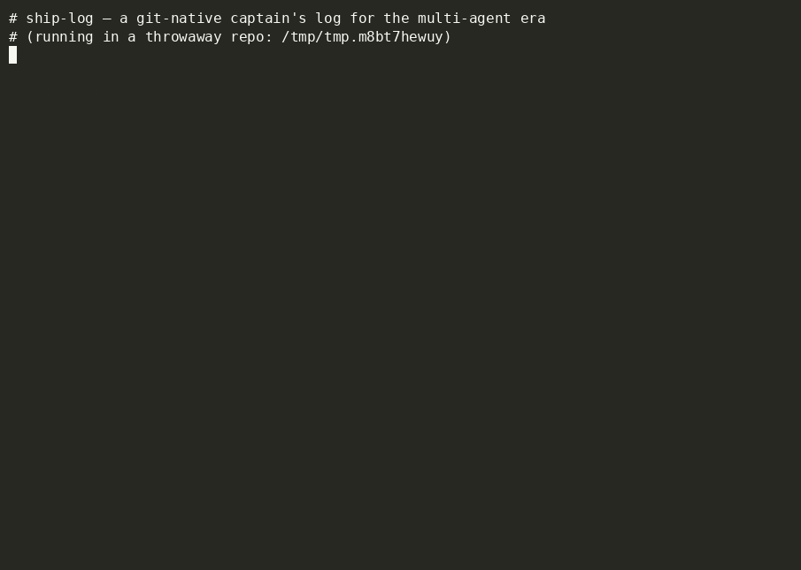

# ship-log 🧭⚓

**A git-native captain's log for the multi-agent era.**

When several AI coding agents (and you) churn the same repo, everyone keeps re-trying the
same already-failed ideas. `ship-log` is a tiny, append-only, plain-text ledger that lives
*inside your repo* (`.shiplog/`). Every **decision**, **attempt**, and **dead-end** gets one
line and a "why." The next agent reads the log before touching code — and skips the graveyard.

> Not `git blame` (who/when). Not a diff reviewer (is-this-good).
> It's the *forward-looking memory* of what's already been tried here.

## Demo



*`brief`-in / `add`-out in ~8 seconds: log a decision and a dead-end, then watch `brief`
lead with the dead-end so the next agent skips the graveyard.* Regenerate it (or grab the
asciinema [`shiplog.cast`](./demo/shiplog.cast)) from [`demo/`](./demo).

## Why

- AI-assisted PR volume is up ~29% YoY — the bottleneck is now **coordination & memory**, not typing.
- `git blame` tells you *who* changed a line, never *what was tried and rejected*.
- Agents have no shared, durable, per-repo memory. Now they do — and it's just a file.

## Install

```bash
pipx install ship-log          # isolated, on your PATH (recommended)
shiplog --version              # -> shiplog 0.1.0
```

> Publishing to PyPI is wired up via OIDC trusted publishing (see
> `.github/workflows/release.yml`); until the first tag lands, install from a clone:

```bash
git clone https://github.com/rwrife/ship-log
cd ship-log
pipx install --editable .      # or, for development: uv pip install -e ".[dev]"
shiplog hello                  # friendly banner; proof the install works
```

## Quickstart

`init`, `add`, `ls`, `show`, and `brief` all work today (through M5).

```bash
shiplog init                   # creates .shiplog/log.jsonl + .shiplog/config.toml (idempotent)
shiplog add decision "Use JSONL not SQLite for the store" \
  --why "merge-friendly + greppable" --files shiplog/store.py --tags storage
shiplog add deadend "Tried threading for append; lock contention" --files shiplog/store.py
```

Every `add` auto-stamps the entry with your git **author**, **branch**, **short sha**, and a
UTC **timestamp** — you only type the `type` + one-line summary (plus optional
`--why/--files/--tags/--ref`). Entries are plain JSONL in `.shiplog/log.jsonl`, so they're
diffable and greppable without the tool.

### Read it back (M4)

```bash
shiplog ls                     # skimmable Rich table, newest first
shiplog ls --type deadend      # skim what NOT to redo
shiplog ls --tag storage       # filter by tag
shiplog ls --file store.py     # entries touching a path (suffix match)
shiplog ls --since 7d          # last 7 days (also: 24h, 2w, or an ISO date)
shiplog ls --json              # stable JSON array for agents/pipes

shiplog show 260621-K3F9Q2     # full detail for one entry (id or unique prefix)
shiplog show 260621-K3 --json  # same, machine-readable object
```

Filters are AND-combined and case-insensitive; `--json` on `ls`/`show` emits clean,
ANSI-free output (array for `ls`, object for `show`) so agents parse instead of scrape.

### Brief it (M5) — the headline feature

`shiplog brief` prints a compact, token-efficient digest to drop straight into an
agent's context **before** it edits — leading with dead-ends (what NOT to redo),
then decisions, prioritizing entries that touch files in your **working tree**.

```bash
shiplog brief                  # markdown digest, dead-ends first, scoped to the working tree
shiplog brief --files cli.py   # focus on specific paths instead of the working tree
shiplog brief --limit 20       # tune the size budget (default 12; 0 = no cap)
shiplog brief --json           # machine-readable: {entries[], focus, total, deadends, ...}
```

Example output:

```markdown
# ship-log brief
_focus: shiplog/store.py · 2 dead-ends · 5 of 5 entries_

## Dead-ends (do NOT redo)
- `260622-534CC7` Tried threading for append; lock contention — GIL + fsync made it slower _(shiplog/store.py)_

## Decisions
- `260622-4RXE2Y` Use JSONL not SQLite — merge-friendly + greppable _(shiplog/store.py)_
```

The digest is ranked *before* the size budget is applied, so truncation always drops
the least-relevant tail — never a dead-end in favor of an old note. Output is plain
markdown (verbatim, no ANSI) so it's clean when piped into a prompt.

### Blame a line — the "why" `git blame` lacks

`shiplog blame <file>:<line>` surfaces the nearest logged decision/dead-end anchored to
a line. `git blame` tells you *who* last touched a line; `shiplog blame` tells you *what
was decided or ruled out there, and why*.

```bash
shiplog blame shiplog/store.py:50   # nearest rationale for line 50, + alternates
shiplog blame store.py:50           # basename works too (path-suffix match)
shiplog blame shiplog/store.py      # no line → all entries touching the file, recent first
shiplog blame shiplog/store.py:50 --json   # stable object: {target, best, alternates, count}
```

Anchor an entry to a line range when you log it, so `blame` can pinpoint it:

```bash
shiplog add deadend "threading the append loop thrashes the lock" \
  --files shiplog/store.py:40-80 --why "GIL + fsync made it slower"
```

A file reference is `path`, `path:line`, or `path:start-end`. Ranking is
**containment → proximity → tighter range → recency**: an entry whose range *covers*
the line wins, then nearer ranges, then whole-file references, with newest breaking ties.
Plain (range-less) entries still match — they just rank below a line-pinned one. If nothing
touches the file you get a friendly hint, not an error.

## For agents

The whole point: an agent runs `shiplog brief` **before** editing and `shiplog add`
**after** making a decision. Drop [`AGENT.md`](./AGENT.md) (or paste its protocol block)
into your agent's instructions — it's copy-paste ready.

```bash
shiplog brief                  # read this BEFORE you edit — skip known dead-ends
# …make a call…
shiplog add deadend "Tried X; it broke Y" --why "..." --files path  # log it AFTER
```

See [`demo/`](./demo) for a runnable walkthrough (`./demo/demo.sh`) plus a recorded
asciinema cast ([`shiplog.cast`](./demo/shiplog.cast)) and the [`shiplog.gif`](./demo/shiplog.gif)
shown above.

## Status

🚧 v0.1 in progress. See [`PLAN.md`](./PLAN.md) for scope, architecture, and milestones (M1–M6).

- **M1** — package scaffold, `shiplog --version` / `shiplog hello`. ✅
- **M2** — append-only JSONL store backbone (`shiplog/models.py` + `shiplog/store.py`): `Entry`
  model, JSONL (de)serialization, sortable ids, file-locked concurrent append + read. ✅
- **M3** — `shiplog init` (creates `.shiplog/` + `config.toml`, idempotent) and `shiplog add`
  (git-stamped append with validation + friendly errors), via `shiplog/gitctx.py` +
  `shiplog/config.py`. ✅
- **M4** — `shiplog ls` (Rich table, newest-first, `--type/--tag/--file/--since/--limit`) and
  `shiplog show <id>` (full detail, id or unique prefix), both with `--json`, via
  `shiplog/filters.py` + `shiplog/render.py`. ✅
- **M5** — `shiplog brief` (token-efficient markdown digest: dead-ends first, then decisions,
  prioritizing working-tree / `--files`; `--limit` size budget; `--json` variant), via
  `shiplog/brief.py`. ✅
- **M6** — polish + agent ergonomics: copy-paste [`AGENT.md`](./AGENT.md) protocol (brief-in /
  add-out), README quickstart, runnable [`demo/`](./demo) walkthrough with a recorded
  [cast + gif](./demo/shiplog.gif), and OIDC trusted-publishing release workflow
  (`.github/workflows/release.yml`) for TestPyPI → PyPI. 🚧 *(remaining: push the
  `v0.1.0` tag once the trusted publisher is configured)*

### Backlog (v0.2+)

- **`shiplog blame <file>:<line>`** — nearest logged decision/dead-end for a line
  (containment → proximity → recency), with `--json`. ✅ Anchor entries via
  `--files path:start-end`.

## License

MIT (see `LICENSE`, added in M1).

---

Part of the `auto-tool-lab` experiment. Built small on purpose.
